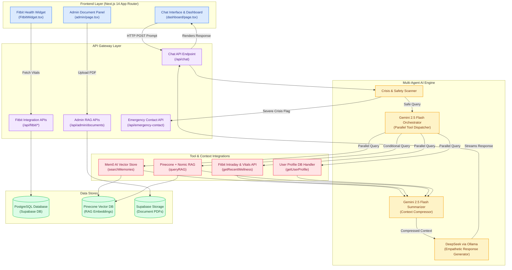
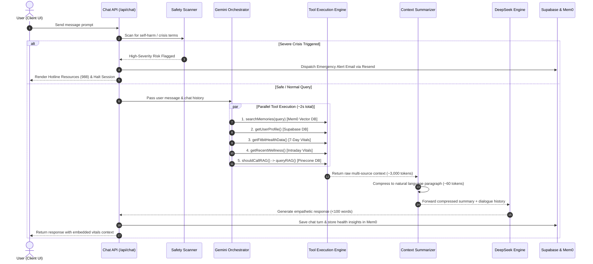
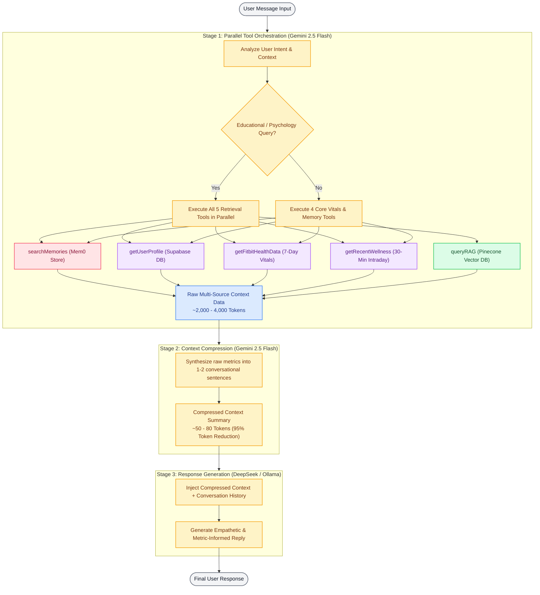
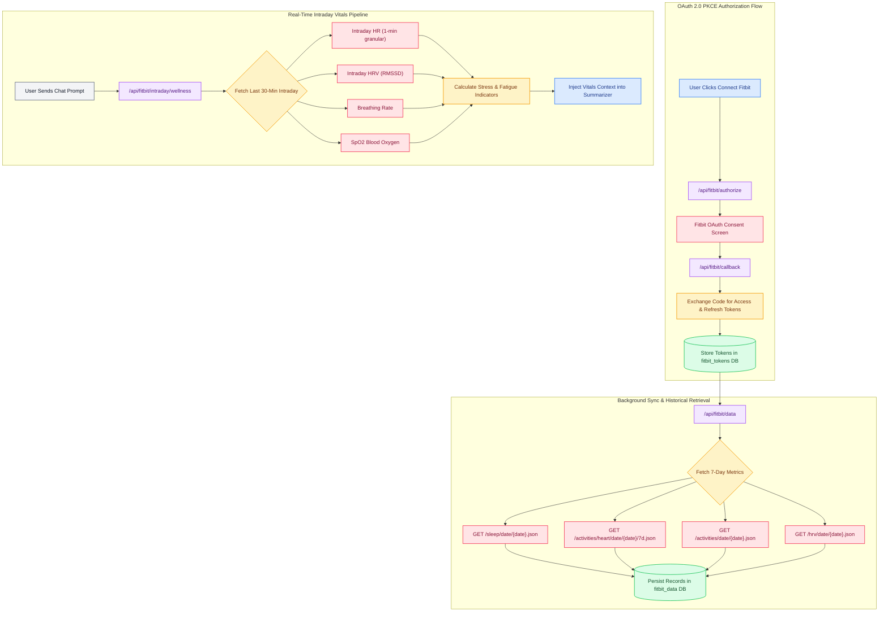
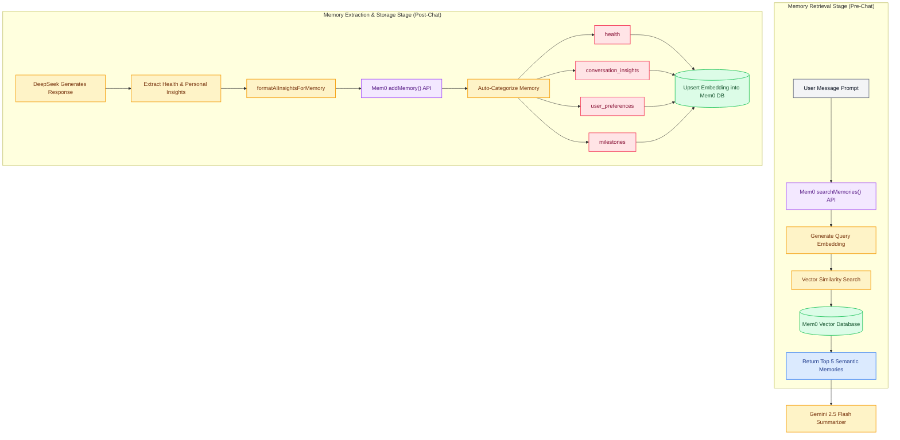
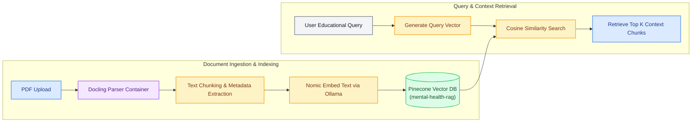
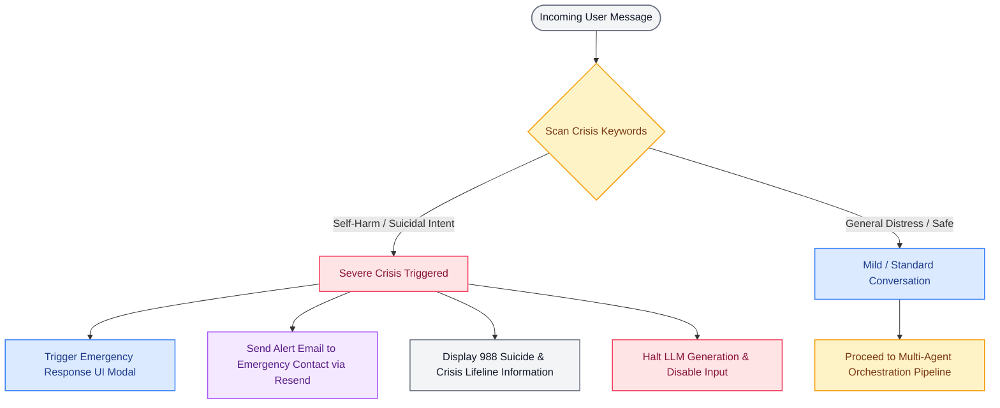
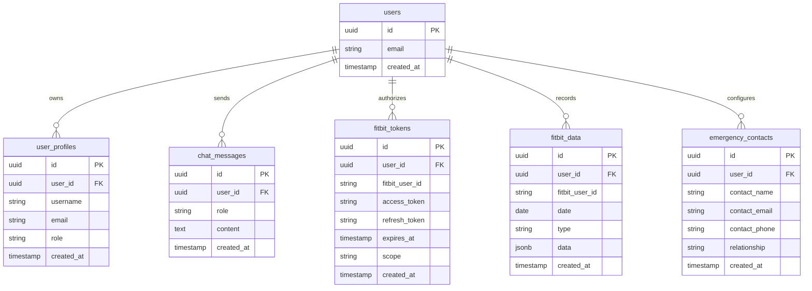

# System Architecture & Sequence Diagrams

> Technical Mermaid.js specification diagrams for the Personalized Mental Wellness Assistant platform.

---

## Table of Contents

- [Overview Architecture](#overview-architecture)
- [Multi-Agent Orchestration Flow](#multi-agent-orchestration-flow)
- [Three-Stage Execution Pipeline](#three-stage-execution-pipeline)
- [Tool Execution Sequence](#tool-execution-sequence)
- [Fitbit Integration & Biometric Flow](#fitbit-integration--biometric-flow)
- [Memory System Architecture](#memory-system-architecture)
- [Retrieval-Augmented Generation (RAG) Pipeline](#retrieval-augmented-generation-rag-pipeline)
- [Crisis Detection & Safety Flow](#crisis-detection--safety-flow)
- [Database Entity-Relationship Schema](#database-entity-relationship-schema)

---

## Overview Architecture

---

## Multi-Agent Orchestration Flow

---

## Three-Stage Execution Pipeline

---

## Fitbit Integration & Biometric Flow

---

## Memory System Architecture

---

## Retrieval-Augmented Generation (RAG) Pipeline

---

## Crisis Detection & Safety Flow

---

## Database Entity-Relationship Schema

