# Multi-Agent Personalized Mental Wellness Assistant

[](https://nextjs.org/)
[](https://www.typescriptlang.org/)
[](https://tailwindcss.com/)
[](https://ai.google.dev/)
[](https://ollama.com/)
[](https://mem0.ai/)
[](https://supabase.com/)
[](https://www.pinecone.io/)
[](LICENSE)

> A production-grade multi-agent conversational AI platform integrating real-time physiological health monitoring, persistent memory retention, and evidence-based psychological retrieval for personalized mental health support.

---

## Table of Contents

- [Overview](#overview)
  - [Architectural Motivation](#architectural-motivation)
- [Application Screenshots & User Interface](#application-screenshots--user-interface)
  - [1. Main Conversational Interface](#1-main-conversational-interface)
  - [2. Safety & Crisis Interception Protocol](#2-safety--crisis-interception-protocol)
  - [3. Automated Emergency Alert Email Dispatch](#3-automated-emergency-alert-email-dispatch)
  - [4. RAG Document Management Panel](#4-rag-document-management-panel)
- [System Architecture](#system-architecture)
  - [High-Level Architecture](#high-level-architecture)
  - [Three-Stage Execution Pipeline](#three-stage-execution-pipeline)
  - [Stage 1: Tool Orchestration](#stage-1-tool-orchestration)
  - [Stage 2: Context Summarization](#stage-2-context-summarization)
  - [Stage 3: Response Generation](#stage-3-response-generation)
- [Tool Execution & Sequence Flow](#tool-execution--sequence-flow)
  - [Tool Ecosystem Specifications](#tool-ecosystem-specifications)
- [Fitbit Biometric Data Pipeline](#fitbit-biometric-data-pipeline)
- [Memory Architecture & Lifecycle](#memory-architecture--lifecycle)
- [Model Fine-Tuning & Evaluation Metrics](#model-fine-tuning--evaluation-metrics)
  - [Training Convergence & Loss Analysis](#training-convergence--loss-analysis)
- [Safety & Crisis Management System](#safety--crisis-management-system)
  - [Crisis Detection Flow](#crisis-detection-flow)
  - [Emergency Protocol](#emergency-protocol)
- [Retrieval-Augmented Generation (RAG) Pipeline](#retrieval-augmented-generation-rag-pipeline)
- [Database Schema & Architecture](#database-schema--architecture)
- [Directory Structure & Module Layout](#directory-structure--module-layout)
- [Additional Technical Documentation](#additional-technical-documentation)
- [Technology Stack](#technology-stack)
- [Setup & Installation](#setup--installation)
- [Environment Configuration](#environment-configuration)
- [API Reference](#api-reference)
- [License](#license)

---

## Overview

The **Personalized Mental Wellness Assistant** is an end-to-end, multi-agent AI framework engineered to deliver context-aware mental health companion services. The platform synchronizes real-time biometric streams from wearable sensors (Fitbit Intraday API), long-term personal context (Mem0 memory layer), and verified clinical psychology literature (Pinecone vector DB + Docling parser) into an empathetic conversational agent.

### Architectural Motivation

Single-model LLM deployments present severe trade-offs when operating on multi-source personal context:

1. **Context Window Inflation & High Latency**: Directly injecting raw health timeseries data, historical conversation archives, and retrieved document passages increases prompt size beyond 4,000 tokens, resulting in latency over 10 seconds per response turn.
2. **Instruction & Role Drift**: Monolithic prompts frequently cause LLMs to output raw metric listings or lose conversational warmth.
3. **Token Inefficiency**: Repeatedly serializing raw biometric arrays consumes excessive API tokens.

To solve these challenges, the platform implements a **Three-Stage Multi-Agent Architecture**:
* **Parallel Tool Orchestration**: Gemini 2.5 Flash concurrently invokes background data retrieval services, reducing context aggregation time from ~8s to ~2s.
* **Context Compression**: Gemini 2.5 Flash condenses multi-source context (~3,000 tokens) into a structured 50-80 token natural language summary (**95%+ token reduction**).
* **Focused Response Generation**: A fine-tuned DeepSeek model consumes the compressed summary to generate concise, empathetic, and clinically bounded responses (<100 words).

---

## Application Screenshots & User Interface

The platform features a modern, responsive UI supporting personalized student greetings, real-time crisis detection banners, emergency alert email dispatches, and an admin portal for PDF document vectorization.

### 1. Main Conversational Interface

Personalized student workspace featuring dark/light theme toggles, prompt shortcuts, and real-time streaming dialogue.

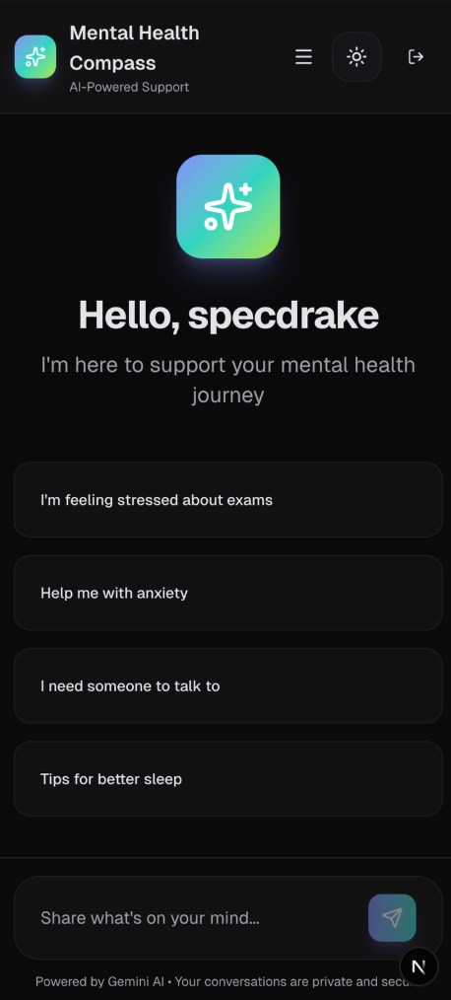

---

### 2. Safety & Crisis Interception Protocol

Active self-harm detection intercepting high-severity crisis queries, rendering 24/7 national hotlines, and temporarily locking session input for user safety.

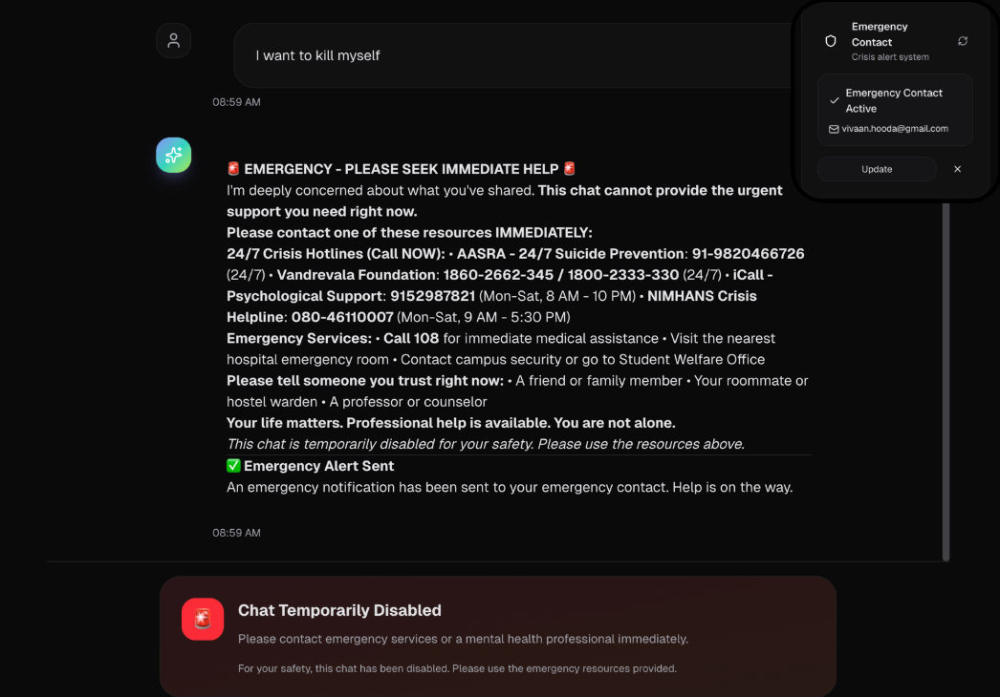

---

### 3. Automated Emergency Alert Email Dispatch

High-priority transactional alert email sent via Resend to linked emergency contacts with immediate intervention steps.

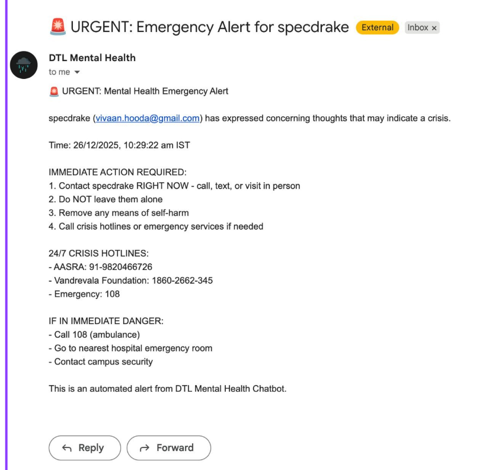

---

### 4. RAG Document Management Panel

Management portal for uploading clinical PDFs, parsing document structures via Docling, and indexing vector embeddings into Pinecone.

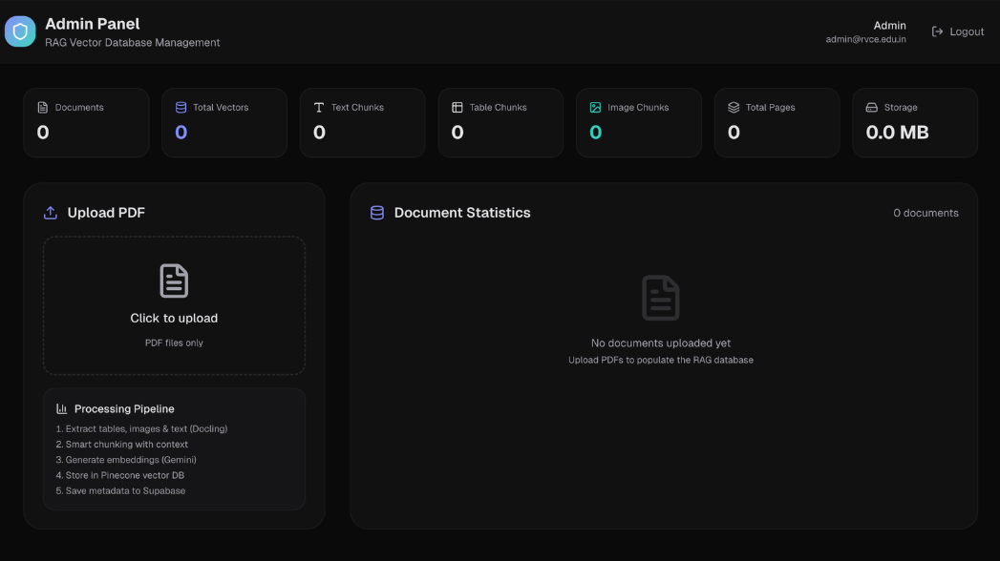

---

## System Architecture

### High-Level Architecture

The framework decouples presentation layer components, serverless API routes, AI orchestration services, and vector/relational databases.

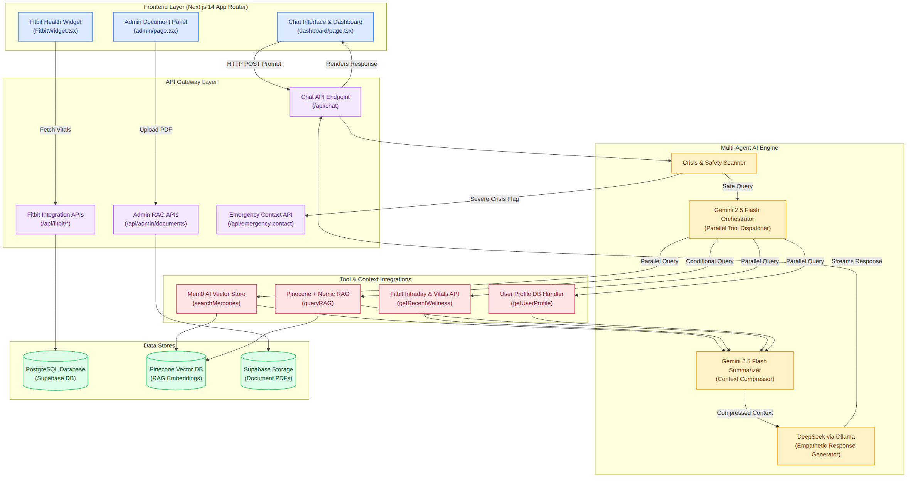
*Diagram specification: [docs/diagrams/system_architecture.mmd](docs/diagrams/system_architecture.mmd) | Full library: [DIAGRAMS.md](DIAGRAMS.md#overview-architecture)*

---

### Three-Stage Execution Pipeline

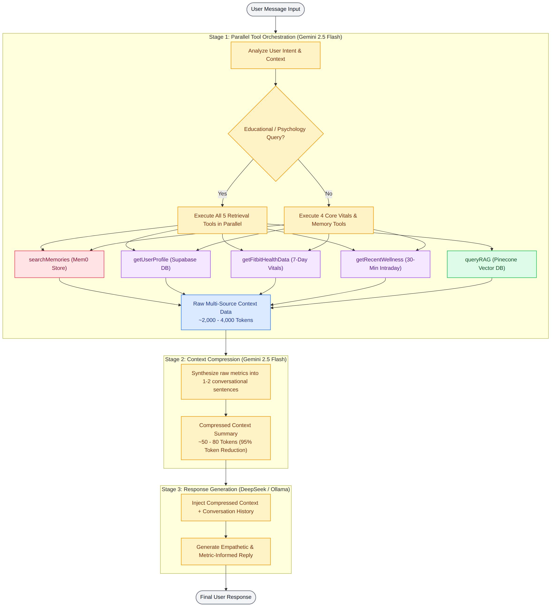
*Diagram specification: [docs/diagrams/three_stage_pipeline.mmd](docs/diagrams/three_stage_pipeline.mmd) | Full library: [DIAGRAMS.md](DIAGRAMS.md#three-stage-execution-pipeline)*

---

### Stage 1: Tool Orchestration

* **Engine**: Gemini 2.5 Flash (`gemini-2.0-flash-exp`)
* **Role**: Evaluates user query intent and concurrently dispatches data retrieval routines.

```typescript
// Parallel execution reduces total tool latency to the slowest single request (~600ms)
const [memories, fitbit, wellness, profile, ragDecision] = await Promise.allSettled([
    executeSearchMemories(userId, { query: userMessage }),
    executeFitbitFetch(userId, { days: 7 }),
    executeRecentWellnessFetch(userId),
    executeGetUserProfile(userId),
    shouldCallRAG(userMessage, conversationHistory)
]);
```

---

### Stage 2: Context Summarization

* **Engine**: Gemini 2.5 Flash
* **Role**: Compresses multi-source JSON artifacts (memories, vitals, document passages) into a natural conversational summary.

```text
Input Payload: ~3,000 Tokens (Raw memory arrays, 7-day activity metrics, intraday HR/HRV, Pinecone chunks)

Compressed Output Summary (~60 Tokens):
"Sarah has been managing exam stress, averaging 3,500 steps daily with a steady resting heart rate of 68 bpm. She previously expressed feeling overwhelmed during finals week."
```

---

### Stage 3: Response Generation

* **Engine**: Fine-Tuned DeepSeek R1 Distill / Llama 3.2 (via Ollama)
* **Role**: Formulates empathetic, concise, and metric-informed responses (<100 words).

```text
Compressed Context: "Sarah has been managing exam stress, averaging 3,500 steps daily with a steady resting heart rate of 68 bpm."
User Message: "I feel anxious about my exam tomorrow."

Generated Response:
"Hi Sarah, I understand exam preparation can bring up significant anxiety. I noticed your resting heart rate is steady at 68 bpm, which is a reassuring indicator of physical stability. Have you had a chance to try the 4-7-8 breathing exercise we discussed earlier? Taking a brief 10-minute walk could also help calm your nervous system."
```

---

## Tool Execution & Sequence Flow

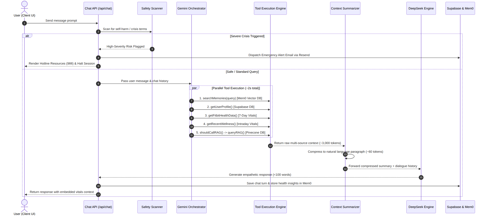
*Diagram specification: [docs/diagrams/tool_execution_flow.mmd](docs/diagrams/tool_execution_flow.mmd) | Full library: [DIAGRAMS.md](DIAGRAMS.md#tool-execution-sequence)*

---

### Tool Ecosystem Specifications

| Function Name | Component / Data Source | Execution Trigger | Latency | Operational Description |
| :--- | :--- | :--- | :--- | :--- |
| `searchMemories` | Mem0 AI Vector Store | Always Active | ~400 ms | Queries vector embeddings for historical preferences, past triggers, and user disclosures. |
| `getUserProfile` | Supabase DB | Always Active | ~150 ms | Fetches demographic profile, user display name, and emergency contact details. |
| `getFitbitHealthData` | Supabase `fitbit_data` | Always Active | ~200 ms | Retrieves 7-day historical trends for resting heart rate, sleep efficiency, and daily steps. |
| `getRecentWellness` | Fitbit Intraday API | Always Active | ~600 ms | Pulls real-time 30-minute vitals including HR, HRV, SpO2, and respiratory rate. |
| `queryRAG` | Pinecone Vector DB | Conditional | ~800 ms | Executed when query requires clinical psychology techniques or CBT concepts. |
| `analyzeHealthWithAI` | Ollama Local Engine | Conditional | ~900 ms | Analyzes correlations between physiological stress indicators and emotional states. |

---

## Fitbit Biometric Data Pipeline

The biometric pipeline handles background OAuth 2.0 PKCE authentication, historical data archiving, and high-frequency intraday vital extraction.

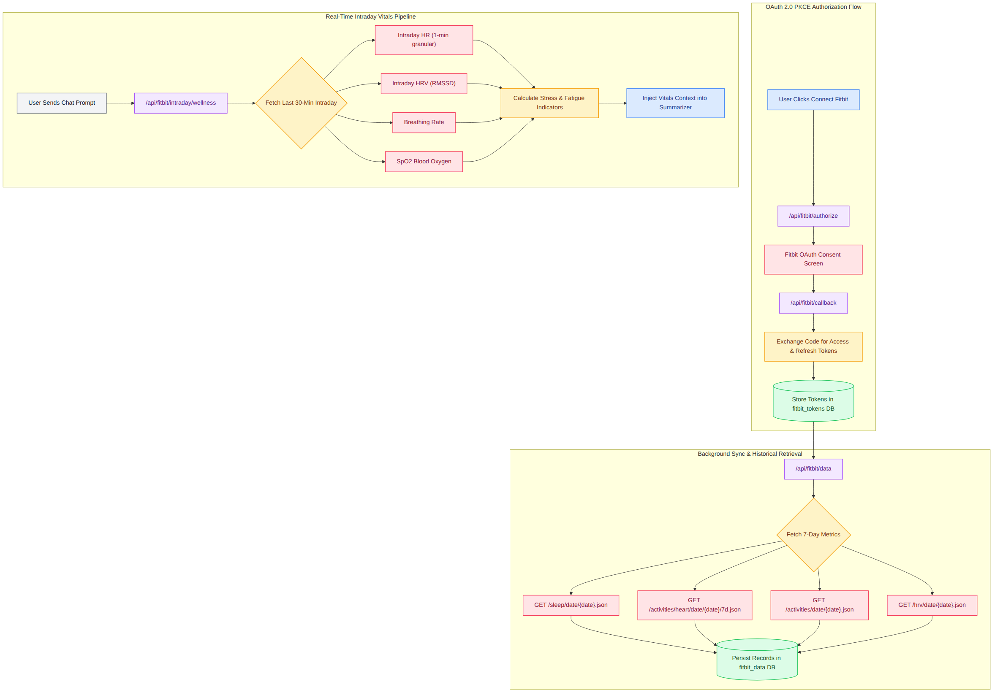
*Diagram specification: [docs/diagrams/fitbit_data_pipeline.mmd](docs/diagrams/fitbit_data_pipeline.mmd) | Full library: [DIAGRAMS.md](DIAGRAMS.md#fitbit-integration--biometric-flow)*

---

## Memory Architecture & Lifecycle

The Mem0 integration maintains a persistent vector memory index across user interactions, storing categorical insights (`health`, `conversation_insights`, `user_preferences`, `milestones`).

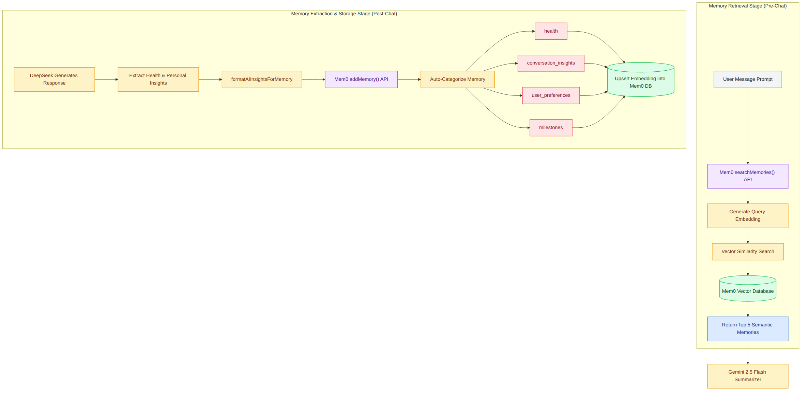
*Diagram specification: [docs/diagrams/memory_lifecycle.mmd](docs/diagrams/memory_lifecycle.mmd) | Full library: [DIAGRAMS.md](DIAGRAMS.md#memory-system-architecture)*

---

## Model Fine-Tuning & Evaluation Metrics

The response generation engine uses a fine-tuned DeepSeek model optimized for empathetic dialogue and metric-informed counseling. Model performance during fine-tuning was tracked across several validation parameters, documented in the [`docs/`](docs) module.

### Training Convergence & Loss Analysis

| Metric Visualization | Technical Description & Interpretation |
| :---: | :--- |
| 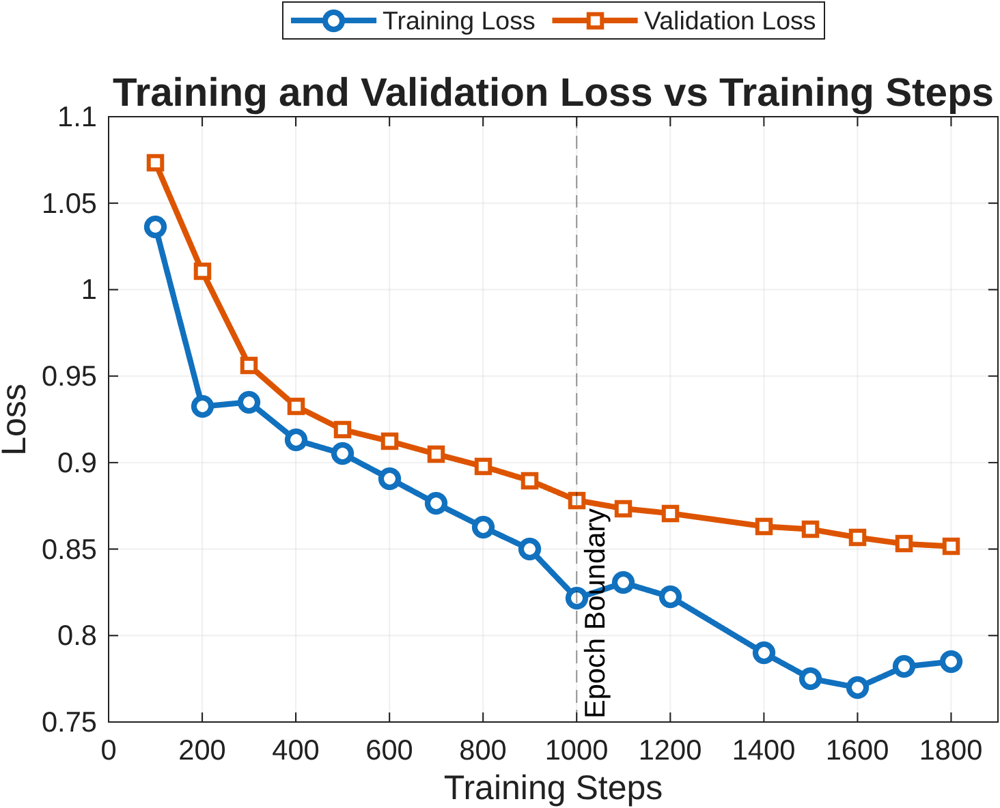 | **Training vs. Validation Loss**<br/>Exhibits monotonic loss reduction over training epochs. Validation loss closely mirrors training loss, confirming proper optimization without overfitting. |
| 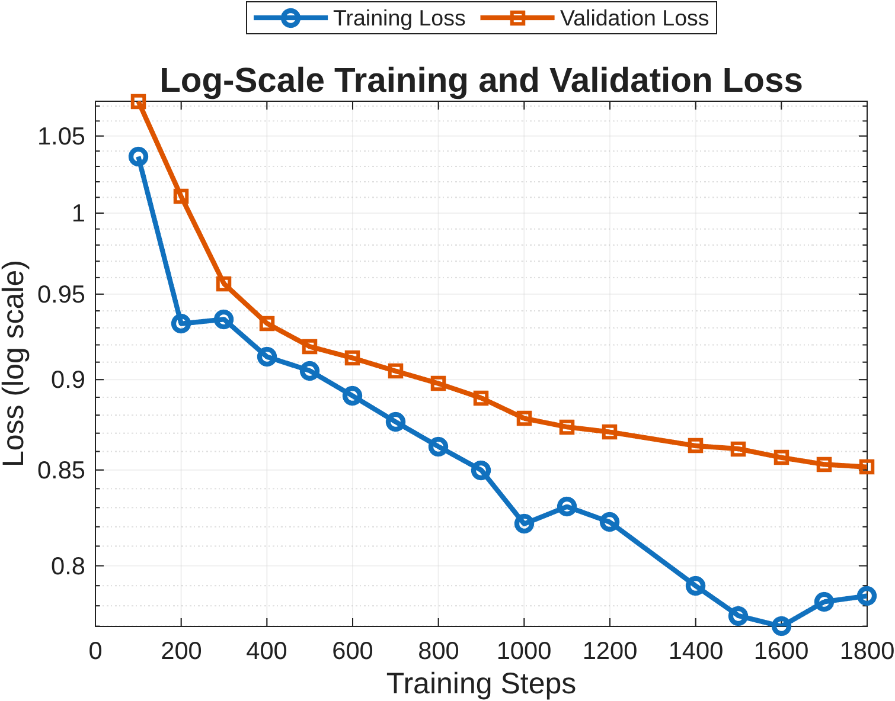 | **Log-Scale Loss Trajectory**<br/>Highlights exponential loss reduction during initial learning steps, stabilizing smoothly into asymptotic fine-tuning convergence. |
| 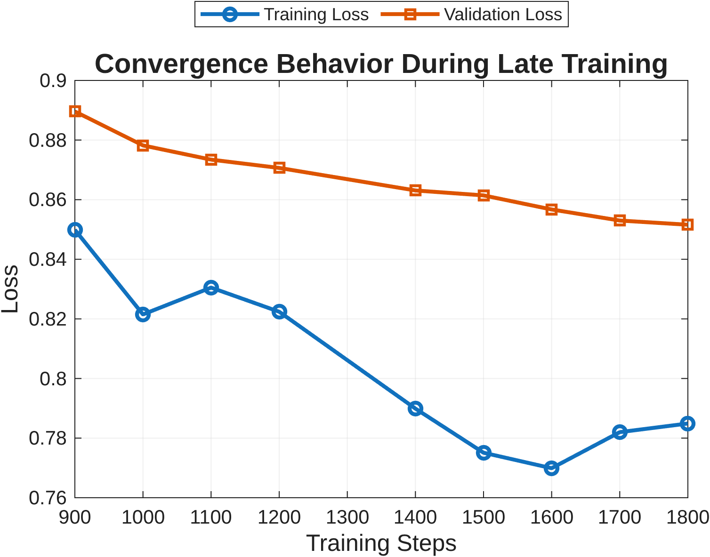 | **Final Epoch Loss Detail**<br/>High-resolution view of late-stage optimization steps, demonstrating minimal loss variance near convergence. |
| 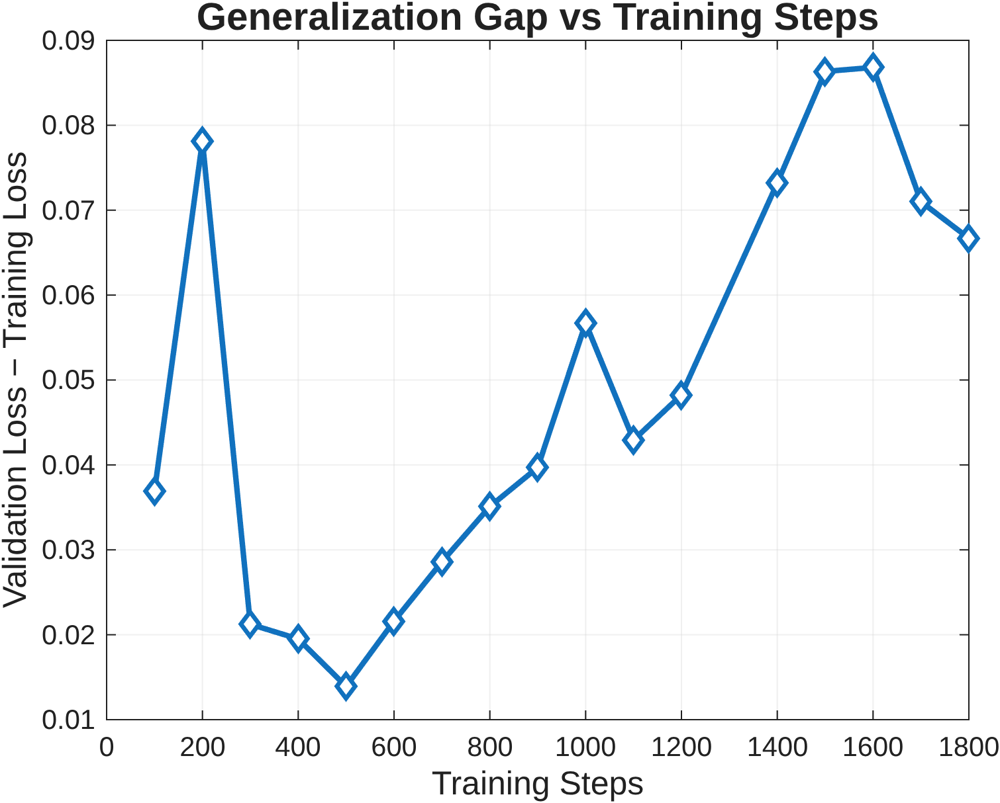 | **Generalization Margin Analysis**<br/>Tracks the differential between validation and training loss ($\mathcal{L}_{\text{val}} - \mathcal{L}_{\text{train}}$), validating tight generalization bounds. |
| 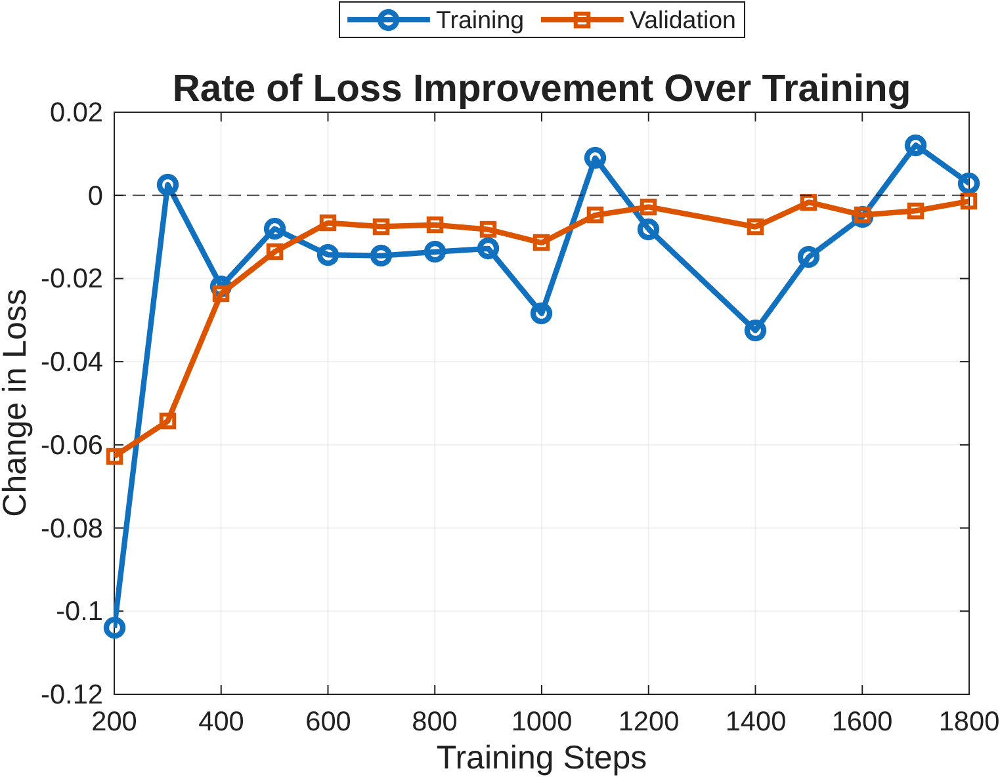 | **Loss Derivative & Gradient Stability**<br/>Evaluates $\frac{d\text{Loss}}{d\text{Step}}$, confirming numerical gradient stability without vanishing or exploding gradients. |
| 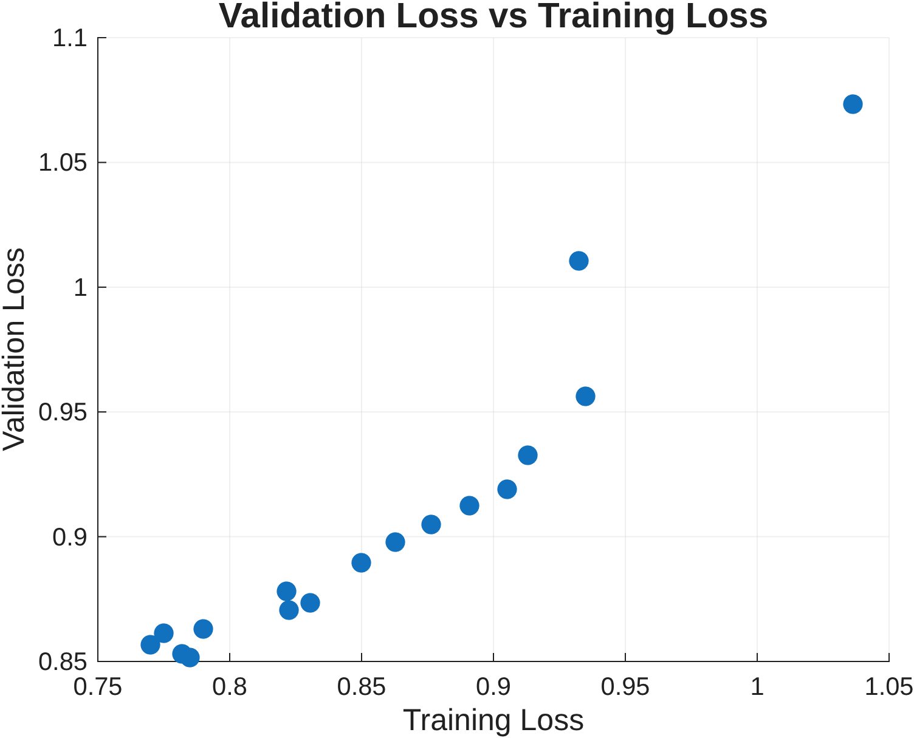 | **Step-Wise Mini-Batch Loss Scatter**<br/>Scatter representation of individual mini-batch losses overlaid with moving average trends across training iterations. |

---

## Safety & Crisis Management System

### Crisis Detection Flow

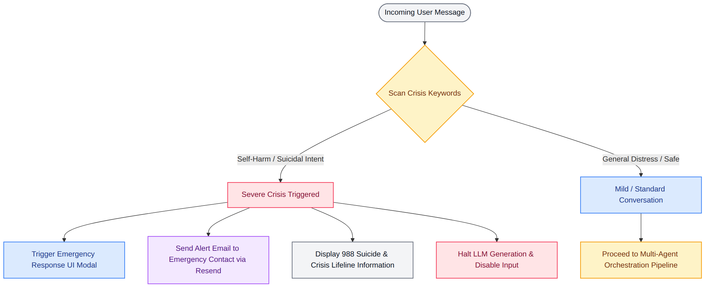
*Diagram specification: [docs/diagrams/crisis_detection_flow.mmd](docs/diagrams/crisis_detection_flow.mmd) | Full library: [DIAGRAMS.md](DIAGRAMS.md#crisis-detection--safety-flow)*

---

### Emergency Protocol

When high-severity risk keywords are flagged, the platform halts LLM execution and dispatches an immediate automated alert email to the user's designated emergency contact via Resend:

```text
Subject: URGENT: Mental Health Safety Alert for [User Name]

Dear [Emergency Contact Name],

This is an automated alert from the Personalized Mental Wellness Assistant.
[User Name] has transmitted statements indicating potential crisis or self-harm risk.

Timestamp: [Date/Time]
User Account: [User Email]

RECOMMENDED ACTIONS:
1. Contact [User Name] immediately to verify their safety.
2. If immediate danger exists, contact local emergency services (911) or the 988 Suicide & Crisis Lifeline.

National Resources:
- 988 Suicide & Crisis Lifeline: Call/Text 988
- Crisis Text Line: Text HOME to 741741
```

---

## Retrieval-Augmented Generation (RAG) Pipeline

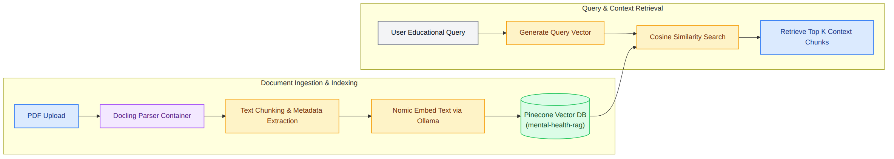
*Diagram specification: [docs/diagrams/rag_pipeline_flow.mmd](docs/diagrams/rag_pipeline_flow.mmd) | Full library: [DIAGRAMS.md](DIAGRAMS.md#retrieval-augmented-generation-rag-pipeline)*

---

## Database Schema & Architecture

The PostgreSQL database (managed via Supabase) enforces referential integrity across user profiles, auth sessions, Fitbit access tokens, timeseries health logs, and emergency contact details.

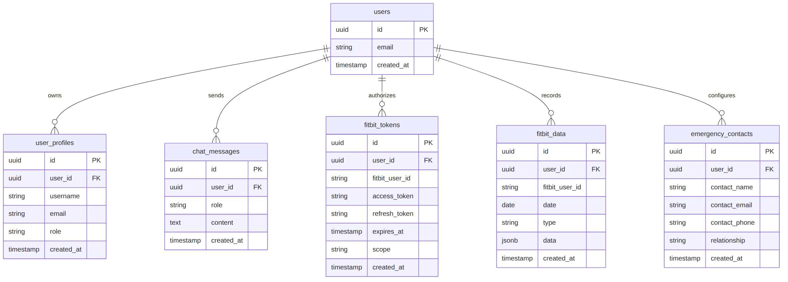
*Diagram specification: [docs/diagrams/database_er_diagram.mmd](docs/diagrams/database_er_diagram.mmd) | Full library: [DIAGRAMS.md](DIAGRAMS.md#database-entity-relationship-schema)*

---

## Directory Structure & Module Layout

```
Personalized-Mental-Wellness-Assistant/
├── docs/                             # Documentation, figures, and rendered diagrams
│   └── diagrams/                     # Source .mmd files, puppeteer configs, and PNGs
├── frontend/                         # Next.js 14 web application
│   ├── app/                          # App Router pages & serverless API routes
│   │   ├── api/
│   │   │   ├── chat/route.ts         # Main multi-agent execution endpoint
│   │   │   ├── fitbit/               # OAuth 2.0 PKCE & Intraday API routes
│   │   │   ├── emergency-contact/    # Emergency contact management API
│   │   │   └── admin/documents/      # PDF processing & vector indexing
│   │   ├── dashboard/page.tsx        # Main chat workspace & biometric widget
│   │   └── admin/page.tsx            # Knowledge base management portal
│   ├── components/                   # UI components & biometric widgets
│   └── lib/                          # Framework client libraries
│       ├── gemini/                   # Flash orchestrator & context summarizer
│       ├── ollama/                   # DeepSeek client & prompt builder
│       ├── mem0/                     # Persistent memory integration
│       ├── fitbit/                   # Biometric analyzers & OAuth handlers
│       ├── pinecone/                 # Vector retrieval pipeline
│       └── safety/                   # Crisis scanning & alert routines
├── python/                           # Model fine-tuning notebooks & scripts
├── database/                         # PostgreSQL schemas & migrations
└── docker-compose.yml                # Container orchestration for Ollama & Docling
```

---

## Additional Technical Documentation

* [`ML_README.md`](ML_README.md): Machine Learning & AI Architecture, Model Fine-Tuning, Hyperparameters, and Loss Evaluation.
* [`ARCHITECTURE.md`](ARCHITECTURE.md): Deep-dive System Architecture Overview, Data Flow Protocols, and Execution Latencies.
* [`DIAGRAMS.md`](DIAGRAMS.md): Full Mermaid.js Source Specification Library.
* [`python/training_deepseek.ipynb`](python/training_deepseek.ipynb): DeepSeek R1 Distill LoRA Fine-Tuning Notebook.
* [`python/training_llama3.ipynb`](python/training_llama3.ipynb): Llama 3.2 Instruct LoRA Fine-Tuning Notebook.

---

## Technology Stack

| Architecture Layer | Technology | Operational Function |
| :--- | :--- | :--- |
| **Frontend Framework** | Next.js 14, React 18, TypeScript | Server-rendered UI, App Router, strict static typing |
| **Styling & Components** | Tailwind CSS, shadcn/ui | Accessible, responsive design system |
| **Orchestration Agent** | Google Gemini 2.5 Flash | High-speed tool routing & context compression |
| **Generation Engine** | DeepSeek R1 Distill / Llama 3.2 (Ollama) | Local/cloud empathetic text generation |
| **Memory Architecture** | Mem0 AI | Vectorized user memory retention & categorization |
| **Vector Database** | Pinecone | Cloud vector database for clinical document retrieval |
| **Text Embeddings** | Ollama `nomic-embed-text` | High-density semantic vector embeddings |
| **Relational Database** | Supabase (PostgreSQL) | Authentication, user profiles, & health trend storage |
| **Document Processing** | Docling (Docker Container) | Structure-preserving PDF extraction & chunking |
| **Biometric Integration** | Fitbit Web API (OAuth 2.0 PKCE) | Historical trends & 30-minute intraday vitals |
| **Alert Delivery** | Resend API | Transactional emergency alert dispatch |

---

## Setup & Installation

### Prerequisites

* Node.js 18.x or higher
* Docker & Docker Compose
* Supabase Account
* Fitbit Developer Credentials
* Pinecone API Key
* Mem0 API Key
* Google Gemini API Key

### 1. Repository Cloning

```bash
git clone https://github.com/VivaanHooda/dtl-mental-health-chatbot.git
cd Personalized-Mental-Wellness-Assistant
```

### 2. Dependency Installation

```bash
cd frontend
npm install
```

### 3. Service Container Execution

```bash
# Pull model artifacts in Ollama
ollama pull llama3.2
ollama pull nomic-embed-text
ollama serve

# Execute supporting services via Docker Compose
docker compose up -d
```

### 4. Local Execution

```bash
npm run dev
```

The application will be accessible at `http://localhost:3000`.

---

## Environment Configuration

Create a `.env` file in `frontend/`:

```bash
# Supabase Database Configuration
NEXT_PUBLIC_SUPABASE_URL=https://your-project.supabase.co
NEXT_PUBLIC_SUPABASE_ANON_KEY=your-anon-key

# Fitbit OAuth Credentials
NEXT_PUBLIC_FITBIT_CLIENT_ID=your-client-id
FITBIT_CLIENT_SECRET=your-fitbit-client-secret
NEXT_PUBLIC_FITBIT_REDIRECT_URI=http://localhost:3000/api/fitbit/callback

# Google Gemini API
GEMINI_API_KEY=your-gemini-api-key

# Local Model Provider (Ollama)
OLLAMA_BASE_URL=http://localhost:11434
OLLAMA_MODEL=llama3.2
OLLAMA_EMBED_MODEL=nomic-embed-text

# Vector Storage & Memory APIs
PINECONE_API_KEY=your-pinecone-api-key
PINECONE_ENVIRONMENT=us-east-1-aws
PINECONE_INDEX_NAME=mental-health-rag
MEM0_API_KEY=your-mem0-api-key

# Supporting Services
DOCLING_URL=http://localhost:5001
RESEND_API_KEY=your-resend-api-key
```

---

## API Reference

### Primary Endpoints

* `POST /api/chat`: Processes chat prompts through the 3-stage multi-agent pipeline.
* `GET /api/fitbit/authorize`: Initiates Fitbit OAuth 2.0 PKCE authorization flow.
* `GET /api/fitbit/callback`: Handles OAuth redirect and exchanges code for access/refresh tokens.
* `GET /api/fitbit/intraday/wellness`: Retrieves 30-minute real-time vitals (HR, HRV, SpO2, breathing rate).
* `POST /api/admin/documents/upload`: Parses PDF documentation via Docling and indexes vectors into Pinecone.
* `POST /api/emergency-contact`: Registers emergency contact metadata for automated alerts.

---

## License

This project is licensed under the **MIT License**. See [`LICENSE`](LICENSE) for complete terms.
